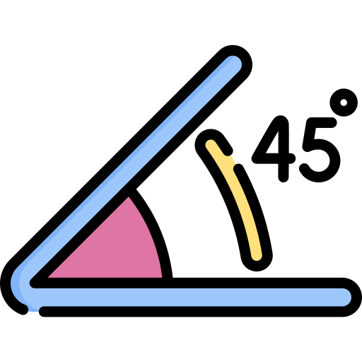
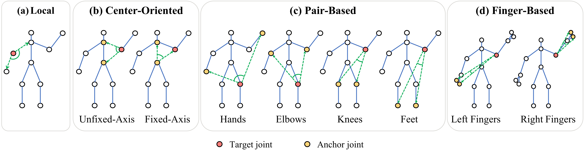
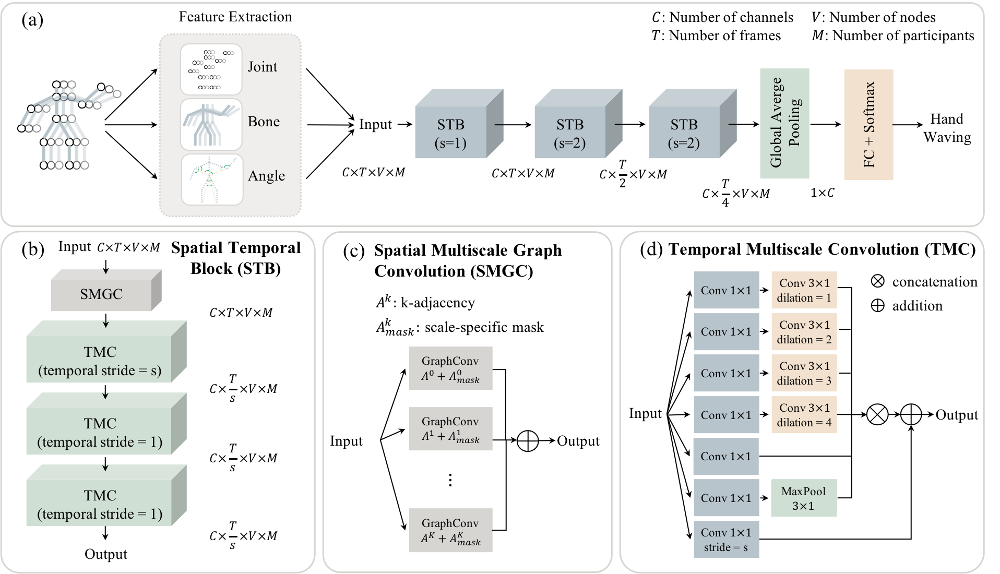

<h1 align="center">
    
    <br>
    Angular Encoding for Skeleton-Based Action Recognition
    <br>
</h1>

<h3 align="center">
Overview
</h3>

<p align="center">
<strong align="center">
PyTorch implementation of "Fusing Higher-Order Features in Graph Neural Networks for Skeleton-Based Action Recognition".
(https://arxiv.org/pdf/2105.01563.pdf). 
</strong>
</p>

## Angular Features



## Network Architecture



## Dependencies

- Python >= 3.6
- PyTorch >= 1.2.0
- [NVIDIA Apex](https://github.com/NVIDIA/apex) (auto mixed precision training)
- PyYAML, tqdm, tensorboardX, matplotlib, seaborn

## Data Preparation

### Download Datasets

There are 2 datasets to download:
- NTU RGB+D 60 Skeleton
- NTU RGB+D 120 Skeleton

Request the datasets here: http://rose1.ntu.edu.sg/Datasets/actionRecognition.asp

### Data Preprocessing

#### Directory Structure

Put downloaded data into the following directory structure:

```
- data/
  - nturgbd_raw/
    - nturgb+d_skeletons/     # from `nturgbd_skeletons_s001_to_s017.zip`
      ...
    - nturgb+d_skeletons120/  # from `nturgbd_skeletons_s018_to_s032.zip`
```

#### Generating Data

- `cd data_gen`
- `python3 ntu_gendata.py`
- `python3 ntu120_gendata.py`
- This can take hours. Better CPUs lead to much faster processing. 

## Training
```
bash train.sh
```

## Testing
```
bash test.sh
```

## Acknowledgements

This repo is based on
  - [MS-G3D](https://github.com/kenziyuliu/ms-g3d)
  - [2s-AGCN](https://github.com/lshiwjx/2s-AGCN)
  - [ST-GCN](https://github.com/yysijie/st-gcn)
  
Thanks to the original authors for their work!

The flat icon is from [Freepik](https://www.freepik.com/). 

## Citation

Please cite this work if you find it useful:

```
@article{DBLP:journals/corr/abs-2105-01563,
  author    = {Zhenyue Qin and Yang Liu and Pan Ji and Dongwoo Kim and Lei Wang and
               Bob McKay and Saeed Anwar and Tom Gedeon},
  title     = {Leveraging Third-Order Features in Skeleton-Based Action Recognition},
  journal   = {CoRR},
  volume    = {abs/2105.01563},
  year      = {2021},
  url       = {https://arxiv.org/abs/2105.01563},
  eprinttype = {arXiv},
  eprint    = {2105.01563},
  timestamp = {Wed, 12 May 2021 15:54:31 +0200},
  biburl    = {https://dblp.org/rec/journals/corr/abs-2105-01563.bib},
  bibsource = {dblp computer science bibliography, https://dblp.org}
}
```


## Contact
If you have further question, please email `zhenyue.qin@anu.edu.au` or `yang.liu3@anu.edu.au`.
